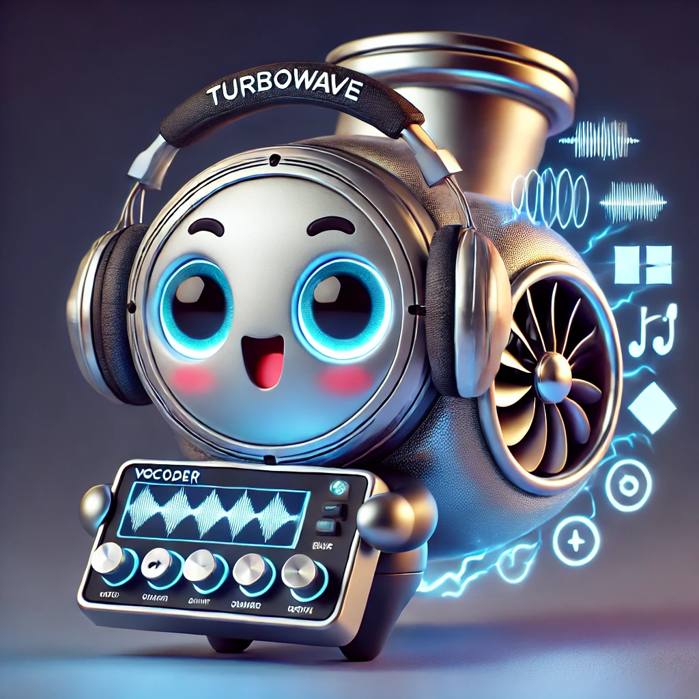

# PeriodWave: Multi-Period Flow Matching for High-Fidelity Waveform Generation <br> <sub>The official implementation of PeriodWave and PeriodWave-Turbo</sub>
<p align="center">
  
</p>

##  <a href="https://arxiv.org/abs/2408.07547"> </a>|[]()|[Demo page](https://periodwave.github.io/demo/)|[PeriodWave-Turbo]( https://periodwave-turbo.github.io/audio-demo/)|[Checkpoint]() 

**Sang-Hoon Lee<sup>1,2</sup>, Ha-Yeong Choi<sup>3</sup>, Seong-Whan Lee<sup>4</sup>**

<sup>1</sup> Department of Software and Computer Engineering, Ajou University, Suwon, Korea<br>
<sup>2</sup> Department of Artificial Intelligence, Ajou University, Suwon, Korea<br>
<sup>3</sup> AI Tech Lab, KT Corp., Seoul, Korea  <br>
<sup>4</sup> Department of Artificial Intelligence, Korea University, Seoul, Korea  <br>

<!--
## Seeking Research Funding Support
I am seeking research funding support for my upcoming project. If you are interested in providing funding or would like more information about the project, please contact me (sanghoonlee@ajou.ac.kr). Thank you for your consideration and support. 

음성 합성 기술, 음성 변환 기술, 실시간 음성 생성 기술 개발 등 다양한 연구를 현재 진행 및 계획 중입니다. 산학협력연구에 관심 있으면 연락 부탁드립니다. (sanghoonlee@ajou.ac.kr)
-->

This repository contains:

- 🪐 A PyTorch implementation of PeriodWave and PeriodWave-Turbo 
- ⚡️ Pre-trained PeriodWave models trained on LibriTTS (24,000 Hz, 100 bins, hop size of 256)
- 💥 Pre-trained PeriodWave models trained on LJSpeech (22,050 Hz, 80 bins, hop size of 256)
- 🛸 A PeriodWave training script

## Update
<!--- 💥 TTS/VC with PeriodWave 

### 24.00.00
- PeriodWave-Turbo Paper Update
### 24.00.00
- We have released PeriodWave-L and PeriodWave-Turbo-L (4 Steps Models). We achieved PESQ of 4.454

### 24.08.00
- We have released PeriodWave-Turbo (4 Steps Models).
- We have released PeriodWave.
-->
### 24.08.16
In this repositoy, we provide a new paradigm and architecture of Neural Vocoder that enables notably fast training and acheives SOTA performance. With 10 times fewer training times, we acheived State-of-The-Art Performance on LJSpeech and LibriTTS.

First, Train the PeriodWave with conditional flow matching. 
- [PeriodWave](https://arxiv.org/abs/2408.07547): The first successful conditional flow matching waveform generator that outperforms GAN-based Neural Vocoders

Second, Accelerate the PeriodWave with adversarial flow matching optimzation. 
- [PeriodWave-Turbo](): SOTA Few-step Generator tuned from PeriodWave


## Todo
### PeriodWave
- [ ] PeriodWave (Trained with LJSpeech, 22.05 kHz, 80 bins)
- [ ] PeriodWave (Trained with LibriTTS-train-960, 24 kHz, 100 bins)
- [ ] Training Code
- [ ] Inference
- [ ] PeriodWave with FreeU (Only Inference)
- [ ] Evaluation (M-STFT, PESQ, Periodicity, V/UV F1, Pitch, UTMOS)
- [ ] PeriodWave-Small (Trained with LibriTTS-train-960, 24 kHz, 100 bins)
- [ ] PeriodWave-Large (Trained with LibriTTS-train-960, 24 kHz, 100 bins)
      
### PeriodWave-Turbo 
- [ ] Paper (PeriodWave-Turbo paper will be released soon.)
- [ ] PeriodWave-Turbo (4 Steps ODE, Euler Method)
- [ ] PeriodWave-Turbo-Small (4 Steps ODE, Euler Method)
- [ ] PeriodWave-Turbo-Large (4 Steps ODE, Euler Method)

We have compared several methods including different reconstuction losses, distillation methods, and GANs for PeriodWave-Turbo. Finetuning the PeriodWave models with fixed steps could significantly improve the performance! The PeriodWave-Turbo utilized the Multi-scale Mel-spectrogram loss and Adversarial Training (MPD, CQT-D) following BigVGAN-v2. We highly appreciate the authors of BigVGAN for their dedication to the open-source implementation. Thanks to their efforts, we were able to quickly experiment and reduce trial and error.

## TTS with PeriodWave
- [ ] PeriodWave with TTS (24 kHz, 100 bins)
      
The era of Mel-spectrograms is returning with advancements in models like P-Flow, VoiceBox, E2-TTS, DiTTo-TTS, ARDiT-TTS, and MELLE. PeriodWave can enhance the audio quality of your TTS models, eliminating the need to rely on codec models. Mel-spectrogram with powerful generative models has the potential to surpass neural codec language models in performance.

<!--
## VC with PeriodWave
- [ ] PeriodWave with [SDT (Speech Diffusion Transformer]() (24 kHz, 80 bins, hop 240)
-->
      
## Getting Started

### Pre-requisites
0. Pytorch >=1.13 and torchaudio >= 0.13
1. Install requirements
```
pip install -r requirements.txt
```
### Prepare Dataset
2. Prepare your own Dataset (We utilized LibriTTS dataset without any preprocessing)
3. Extract Energy Min/Max
```
python extract_energy.py
```
4. Change energy_max, energy_min in Config.json
   
### Train PeriodWave
```
CUDA_VISIBLE_DEVICES=0,1,2,3 python train_periodwave.py -c configs/periodwave.json -m periodwave
```

### Train PeriodWave-Turbo
- Finetuning the PeriodWave with fixed steps can improve the entire performance and accelerate the inference speed (NFE 32 --> 2 or 4)
```
CUDA_VISIBLE_DEVICES=0,1,2,3 python train_periodwave_turbo.py -c configs/periodwave_turbo.json -m periodwave_turbo
```

### Inference PeriodWave (24 kHz)
```
# PeriodWave
CUDA_VISIBLE_DEVICES=0 python inference.py --ckpt "logs/periodwave_base_libritts/G_1000000.pth" --iter 16 --noise_scale 0.667 --solver 'midpoint'

# PeriodWave with FreeU (--s_w 0.9 --b_w 1.1)
# Decreasing skip features could reduce the high-frequency noise of generated samples
# We only recommend using FreeU with PeriodWave. Note that PeriodWave-Turbe with FreeU has different aspects so we do not use FreeU with PeriodWave-Turbo. 
CUDA_VISIBLE_DEVICES=0 python inference_with_FreeU.py --ckpt "logs/periodwave_libritts/G_1000000.pth" --iter 16 --noise_scale 0.667 --solver 'midpoint' --s_w 0.9 --b_w 1.1

# PeriodWave-Turbo-4steps (Highly Recommended)
CUDA_VISIBLE_DEVICES=0 python inference.py --ckpt "logs/periodwave_turbo_base_step4_libritts_24000hz/G_274000.pth" --iter 4 --noise_scale 1 --solver 'euler'
```

<!--
## Modification after paper submission
### 6 kHz Band Noise Issue
- We found that the generated samples contain 6 kHz band noise. (Unfortunately, I could not hear this sound... but someone told me this issue. I checked it by visualization of spectrogram)
- We experimented over 50 modified models after submission... (Activation, Low-pass filter, add/concat, activation position, down/up-sampling position, etc.)
- We observed that the main reason is the down/up-sampling position of our Unet structure. We modified the model that can use the skip-connection for the features of original resolution to feed it to the decoder.
- Also, the concatnation of skip-features could remove the band noise, however, this decreases the performance while the noise band is removed. (This means that the stacked noise over ODE steps make the samples with 6 kHz band noise.
- We all re-train the model, and improve the performance compared to the submision version.
-->

## Reference
### Flow Matching for high-quality and efficient generative model
- FM: https://openreview.net/forum?id=PqvMRDCJT9t
- VoiceBox (Mel-spectrogram Generation): https://openreview.net/forum?id=gzCS252hCO&noteId=e2GZZfeO9g
- P-Flow (Mel-spectrogram Generation): https://openreview.net/forum?id=zNA7u7wtIN
- RF-Wave (Waveform Generation): https://github.com/bfs18/rfwave (After paper submission, we found that the paper RF-Wave also utilized FM for waveform generation. They used it on the complex spectrogram domain for efficient waveform generation. It is cool idea!)
  
### Inspired by the multi-period discriminator of HiFi-GAN, we first distillate the multi-periodic property in generator
- HiFi-GAN: https://github.com/jik876/hifi-gan

### Prior Distribution
- PriorGrad: https://github.com/microsoft/NeuralSpeech/tree/master/PriorGrad-vocoder

### Frequency-wise waveform modeling due to the limitation of high-frequency modeling
- Fre-GAN 2: https://github.com/prml-lab-speech-team/demo/tree/master/FreGAN2/code
- MBD (Multi-band Diffusion): https://github.com/facebookresearch/audiocraft
- FreGrad: https://github.com/kaistmm/fregrad

### High-efficient temporal modeling
- Vocos: https://github.com/gemelo-ai/vocos
- ConvNeXt-V2: https://github.com/facebookresearch/ConvNeXt-V2
  
### Large-scale Universal Vocoder
- BigVGAN: https://arxiv.org/abs/2206.04658
- BigVSAN: https://github.com/sony/bigvsan
